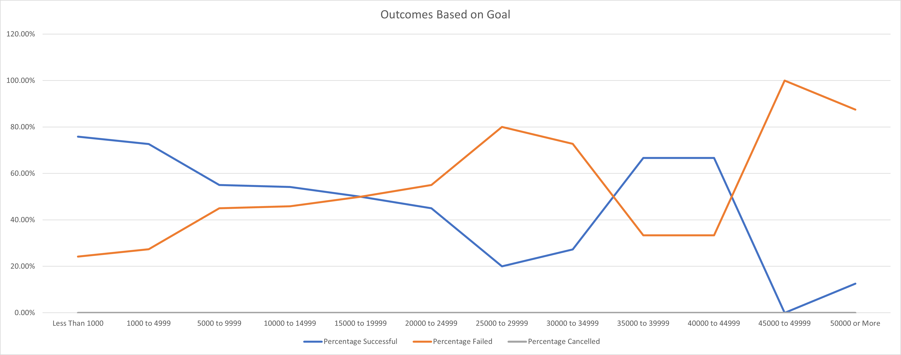

# Kickstarting with Excel

## Overview
For the Module 1 Challenge we were tasked with creating pivot tables and extra worksheets to better display the data that our client is most concerned with. We filtered the data looking for plays, and then made a pivot table based on the launch dates and outcomes. We then made charts and graphs to better visualize the data for our client and provided statistical analysis of successful/failed/canceled kickstaters.

### Purpose
From the client's perspective the data we provided should help her in better formulating a plan as to when the kickstarter should be launched and where to set the goal. All in the interest of maximizing her potential for launching a successful kickstarter campaign. From our perspective, this exercise provided a great real world environment in which we would need to use our knowledge of Excel in order to fulfill our job requirements. All the skills we learned are practical and can be translated to any number of tasks we may need to complete in the future.

## Analysis of Theatre Outcomes by Launch Date
I performed the analysis by creating a pivot table based on the raw kickstarter data; filtering for the theatre category. From that pivot table, I created a line graph showing when the most successful and least successful kickstarters were launched. 
Based on the data, the best time to start a theatre kickstarter would be in May with the worst times being in November or December.

## Analysis of Outcomes based on Goals
This dataset was created by using the COUNTIFS function in Excel to count the number of successful/failed/canceled theatre kickstarters in the US based on their respective goal. I then calculated the percentage of successful vs failed vs canceled kackstarters for each goal bracket. My main challenge with this task was copying the target columns from the function used in the successful column. Creating the functions for the successful column in the new Outcomes vs Goals worksheet was easy enough, but when i tried to copy these functions one row over into the failed column the target columns for the functions shifted a row over as well. So, i had to manually rewrite each function with the correct target column. I'm sure there is a workaround for this but i was unable to find one.

## Results
Some conclusions I can draw about the Theatre Outcomnes vs Launch Date analysis is that the best time for the client to launch her theatre kickstarter would be in late April or early May; these areas show the highest amount of successful theatre kickstarters. Also the worst time to launch her kickstarter would be later in the year around November of December, with a pretty steady decline in successful campaigns heading into the later months of the year. One limitation that I noticed is that the failed kickstarters seem to remain constant throughout the year with a slight peak around the same time as the successful peak. This could indicate that the reason for the apparent increase in success around May could just be because that is the most popular time to create theatre kickstarters, creating a false peak around that time.

As far as the Outcomes Based on Goals analysis, I can assume that this data, while interesting, wouldn't be very useful in assisting our client in setting  a goal for her own kickstarter. This is due to there not really being a strong correlation between successful vs. failed kickstarters based on their goal. 
The graph doesn't show a strong reason to suspect that any goal amount would have a higher chance of success than another. This could be because the graph is based on percentages instead of a count of each campaign in each goal bracket. I think that a graph created on the raw data of outcomes vs goals instaed of the percentages would yeild a more insightful visual of the data.

